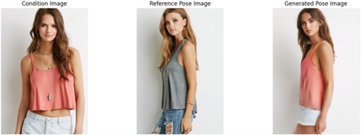
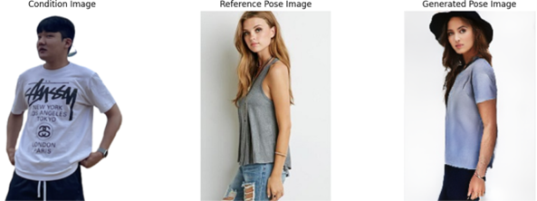
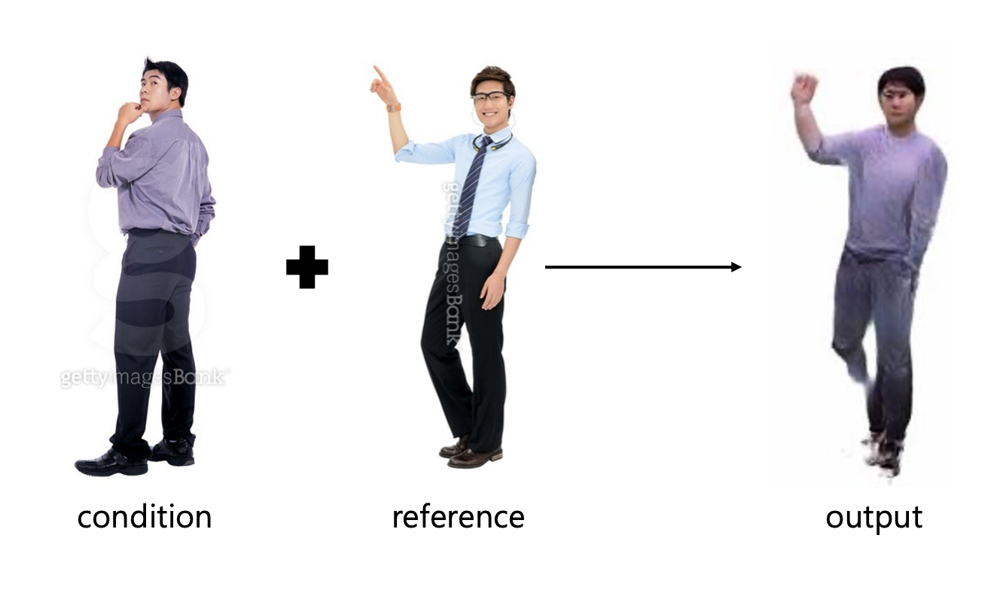

# PPT-Application: AI-Powered Position / Pose Reconstruction System

### 🚀 Project Summary
PPT-Application is an AI-powered image editing tool that allows users to seamlessly modify subject poses and positions in photos. This cutting-edge solution goes beyond traditional photo editing features to offer an intuitive, high-quality experience for both individual and professional users.

-------

### Key Features
- **Pose Transfer**: Automatically modifies a person's pose based on a reference image.
- **Inpainting**: Smoothly fills background after separating the subject.
- **Repositioning**: Places the pose-modified subject into a specified location within the image.

------

## Application Testing Guide

If you want to test our application instead of the Pose Transfer feature, the necessary code is available in the `pipeline` folder. Follow these steps:

1. Place the input images in the `input` folder.
2. Run `main.py` to perform segmentation and inpainting.
3. Finally, run `edit_person.py` to position the segmented person anywhere in the image and merge it with the background.

---

### Pipeline Folder Structure

pipeline/

├── BiRefNet/                         # BiRefNet model code and related files

├── BiRefNet-general-epoch_244.pth    # Pre-trained weights for BiRefNet

├── input/                            # Folder to store original input images

├── mask/                             # Stores masks generated from segmentation

├── person_only/                      # Stores images of segmented persons only

├── background_only/                  # Stores images of the background without the person

├── inpainting_results/               # Stores results of inpainting with Stability AI

├── main.py                           # Code for segmentation and inpainting

└── edit_person.py                    # Code to reposition the person and merge with the background

-------

## Demo


https://github.com/user-attachments/assets/c2608fdd-ea77-413a-86e9-1d0732d415db

------

## 🏁 Conclusion and Future Work

The PPT-Application project aimed to develop an AI-powered system capable of transforming subject poses and naturally merging them into high-quality reconstructed images. In a society where the demand for personalized content creation and image editing efficiency is rapidly increasing, this project sought to revolutionize image editing quality and productivity.

Despite promising advancements, the project faced notable challenges. Thus, we decided not to include the pose transformation feature in the application. 

Notable challenges :

### Limitations
1. **Pose Transfer Issues**:
   - Domain mismatch caused the model to retain foreign facial features when applied to local subjects.
   - Repositioning errors resulted in visual misalignments and artifacts.

   #### Example:
   **Successful Pose Transfer (Foreign Subject)**  
   

   **Failed Pose Transfer (Local Subject)**  
   

   **After Fine-tuned**
   
   

3. **Processing Speed Constraints**:
   - CPU-based processing averaged 60 seconds per image, limiting real-time usability.

### Future Directions
- Enhance **data diversity** by incorporating more inclusive datasets to improve model generalization.
- Transition to **Diffusion Models** for more adaptable and higher-quality pose transformations.
- Adopt GPU-based processing to reduce latency and improve user experience.
- Expand functionalities for multi-subject editing and advanced lighting adjustments.

PPT-Application's base Transfer model is from 
[Roy et al. (2023)](https://arxiv.org/abs/2202.06777), [code](https://github.com/prasunroy/pose-transfer?tab=readme-ov-file), and we fine-tune it with an additional [dataset](https://www.aihub.or.kr/aihubdata/data/view.do?currMenu=115&topMenu=100&aihubDataSe=data&dataSetSn=71704) for multiracial transformation.

-------

## Citation

```bibtex
@article{roy2022multi,
  title   = {Multi-scale Attention Guided Pose Transfer},
  author  = {Roy, Prasun and Bhattacharya, Saumik and Ghosh, Subhankar and Pal, Umapada},
  journal = {Pattern Recognition},
  volume  = {137},
  pages   = {109315},
  year    = {2023},
  issn    = {0031-3203},
  doi     = {https://doi.org/10.1016/j.patcog.2023.109315}
}
```
